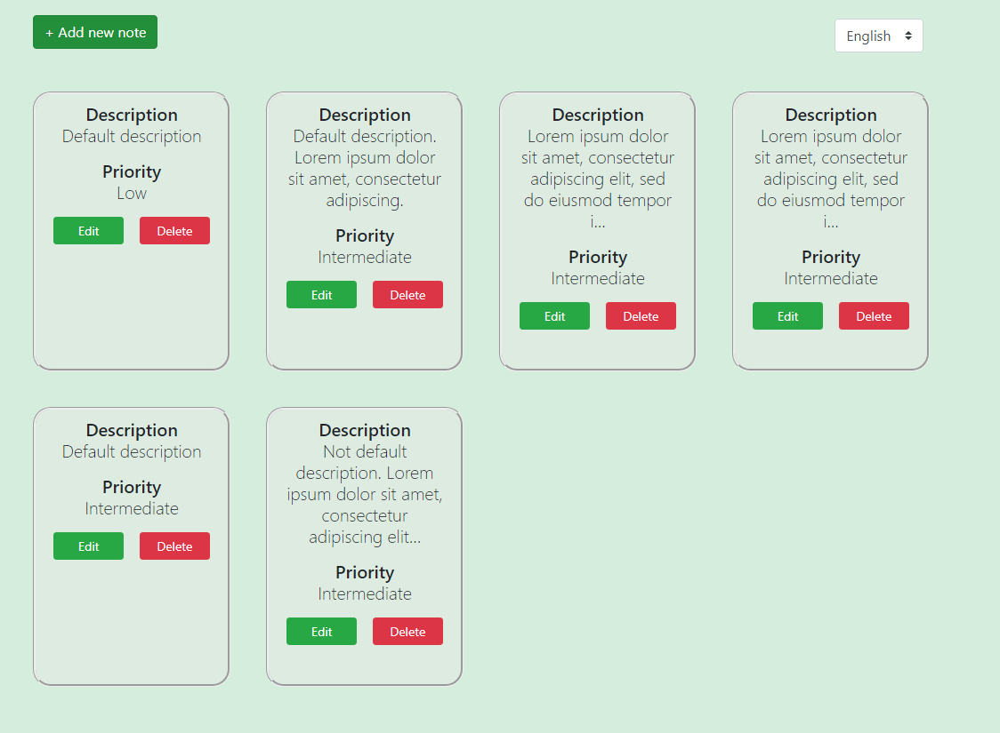
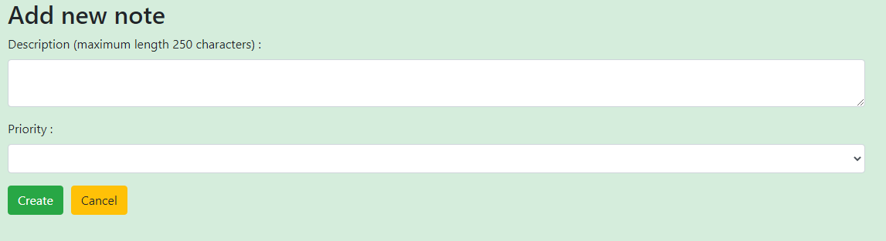
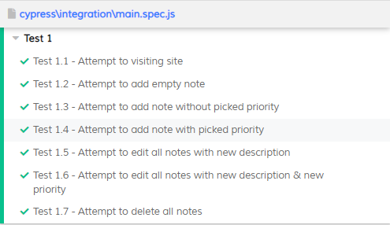

<h2>MyNotes - Preview</h2>

<h2>Installation tutorial</h2>
<h3>Client</h3>
<ul><b>
  <li>npm install</li>
  <li>ng serve</li>
</ul></b>
<h3>Server</h3>
<ul><b>
  <li>Run server as Kestrel server</li>
</ul></b>
<h3>E2E Testing</h3>

<ul><b>
  <li>Launch terminal from 'Client' folder</li>
  <li>npm install cypress</li>
  <li>./node_modules/.bin/cypress open</li>
  <li>In opened window click 'main.spec.js' and first test (with default localization) will launch automatically</li>
  <li>You can switch another localization language inside 'main.spec.js':</li>
  <ul>
    <li>BEFORE EACH TEST RESTART THE SERVER TO RESTORE DATA</li>
    <li>cy.get('.custom-select').select('en').should('have.value','en'); //<<-- TEST FOR EN LOCALIZATION (DEFAULT)</li>
    <li>cy.get('.custom-select').select('de').should('have.value','de'); //<<-- TEST FOR DE LOCALIZATION</li>
    <li>cy.get('.custom-select').select('ru').should('have.value','ru'); //<<-- TEST FOR RU LOCALIZATION</li>
  </ul>
</ul></b>
